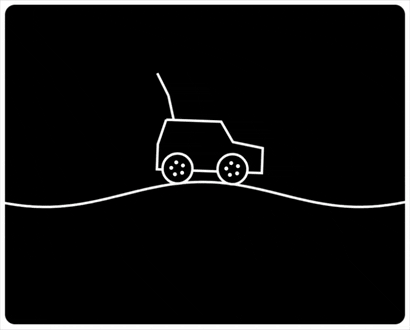
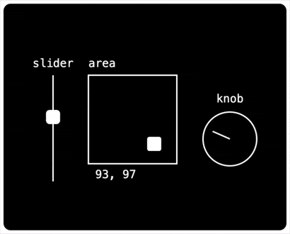
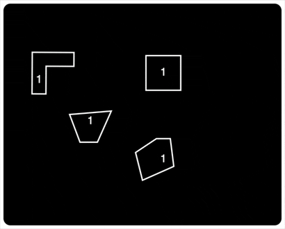
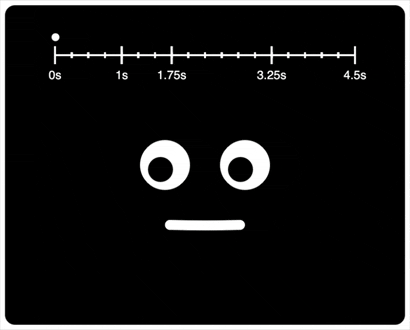
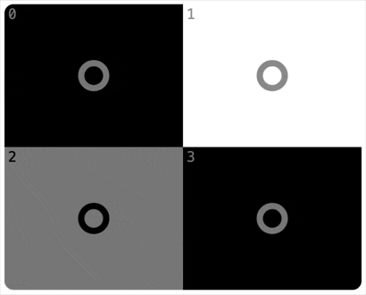
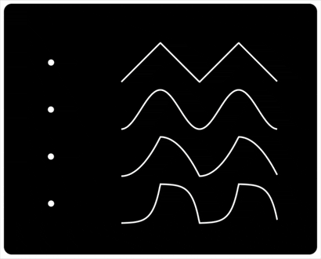

# Raw Canvas

Raw Canvas is a small imperative framework for graphics and animations in HTML Canvas. 

At 10 kB unzipped it is **minimal, no-build, and bare bones** exposing the raw canvas.

The imperative approach makes the framework non invasive, making the user write code for each thing that should happen. This is in contrast to the many declarative animation frameworks where the user rather states the features of the animation out of touch with how it will actually be executed.

## Examples

See all examples at https://holgerl.github.io/raw/examples/index.html

### Hierarchical scene graph



### Staggered animation and camera movement


### Dragging with mouse and touch



### Collision detection with complex polygons



### Timer with phases



### Grid distribution



### Easing waves



## Usage

```html
<script src="https://holgerl.github.io/raw/dist/raw.build.js"></script>
<script>
    Raw.init(document.getElementById('myCanvas'));
    Raw.settings.clearColor = "#000";

    function loop() {
        Raw.onFrame();
        requestAnimationFrame(loop);
    }

    loop();

    const square = Raw.scenegraph.add({
        update: function() {
            this.rotation += Raw.deltaSeconds;
        },
        draw: function(ctx, canvas) {
            ctx.strokeStyle = "#fff";
            ctx.lineWidth = 4;
            ctx.strokeRect(-40, -40, 80, 80);
        }
    });

    square.scale = {x: 1.5, y: 1.5};
</script>
```